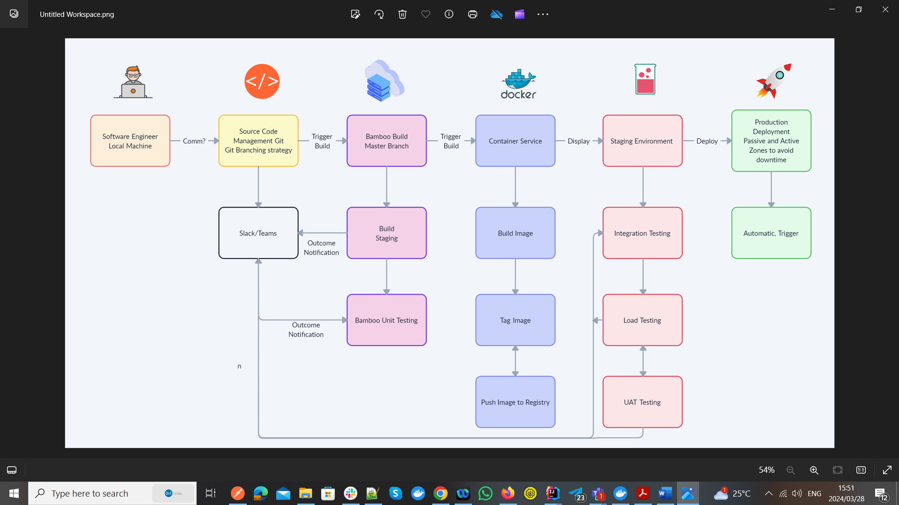

This repository is created for a simple Websocket chat application with MongoDB integration. The project uses STOMP protocol with SockJS integrated with Spring Websocket API.

To run this on your local you need MongoDB to be installed.

APPLICATION
To run the application :
1. Run maven clean install to pull dependencies
2. Run the application and it will be running port 8080.
3. You are ready to test. http://localhost:8080/

NB: Please note was not able to export the web socket collection since that functionality is still not available.
Due to time constraints I was not able to do the authentication section for username and password to join the chat.
For CI/CD please note I have attached a skeleton deployment diagram under resources folder named : 

MONGO DATABASE

brew install mongodb
After installing it, you should create a default directory for storing the data:

mkdir -p /data/db
Also please make sure that the directory has the right privileges with:

sudo chown -R `id -un` /data/db
Finally you can run MongoDB with the following command:

mongod --p 27017 (default is this)
After running the MongoDB, you can run the application and by default it will launch on port 8080. You can access it from:

